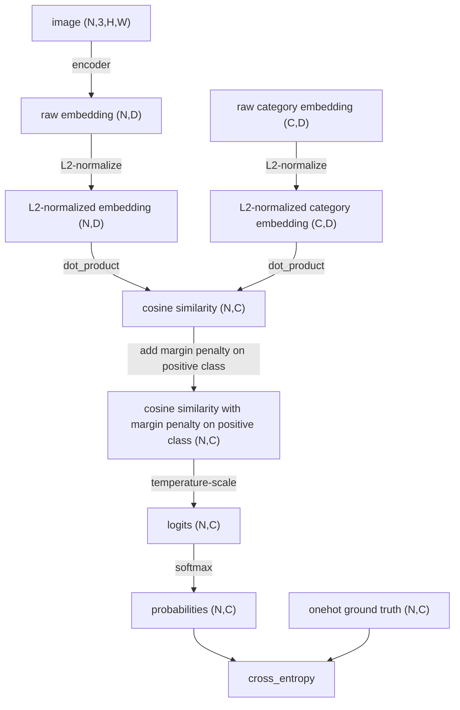
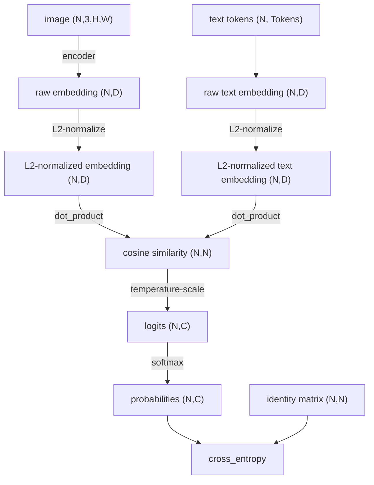

# Contrastive Learning

## Angular Margin Loss in Metric Learning

ArcFace/CosFace,SphereFace, etc.

Formulate as category classification,
num_classes = num of categories

num of cosine similarity values = batch size x num_classes

## NT-Xent or InfoNCE

NT-Xent (Normalized temperature-scaled cross entropy) a.k.a InfoNCE (Information Noise Contrastive Estimation)

InfoNCE may not include temperature-scaling.

CLIP

Using in-batch negatives,
num_classes = batch size

num of cosine similarity values = batch size *num_classes = batch size x batch size
