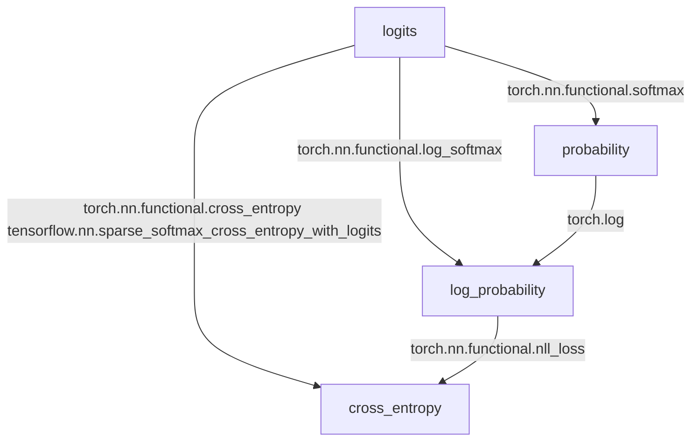
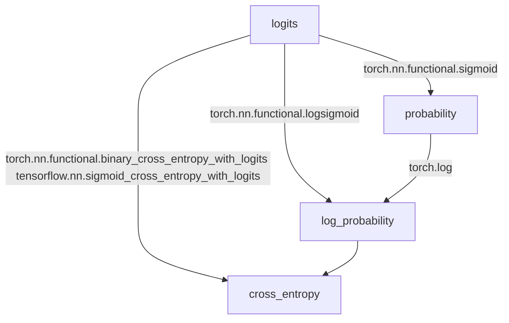

# Cross Entropy

## multi-class

```mermaid
flowchart TB
logits -- "torch.nn.functional.cross_entropy tensorflow.nn.sparse_softmax_cross_entropy_with_logits" --> cross_entropy
logits -- "torch.nn.functional.log_softmax" --> log_probability -- "torch.nn.functional.nll_loss" --> cross_entropy
logits -- "torch.nn.functional.softmax" --> probability -- "torch.log" --> log_probability
```

## multi-label

```mermaid
flowchart TB
logits -- "torch.nn.functional.binary_cross_entropy_with_logits tensorflow.nn.sigmoid_cross_entropy_with_logits" --> cross_entropy
logits -- "torch.nn.functional.logsigmoid" --> log_probability --> cross_entropy
logits -- "torch.nn.functional.sigmoid" --> probability -- "torch.log" --> log_probability
```
